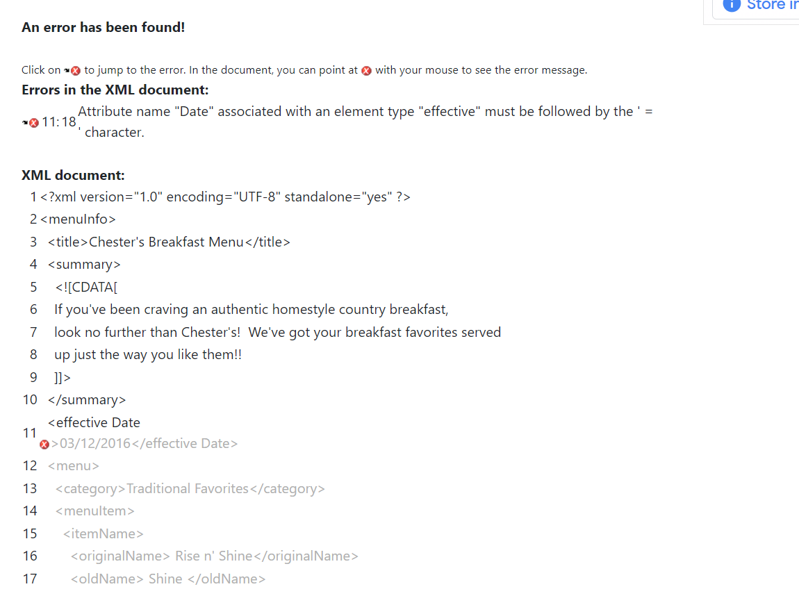
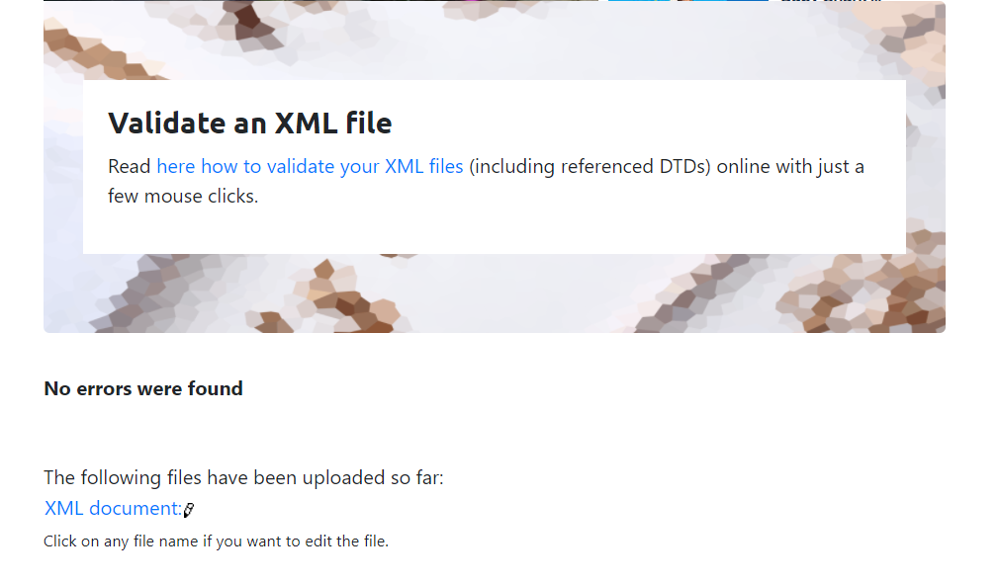
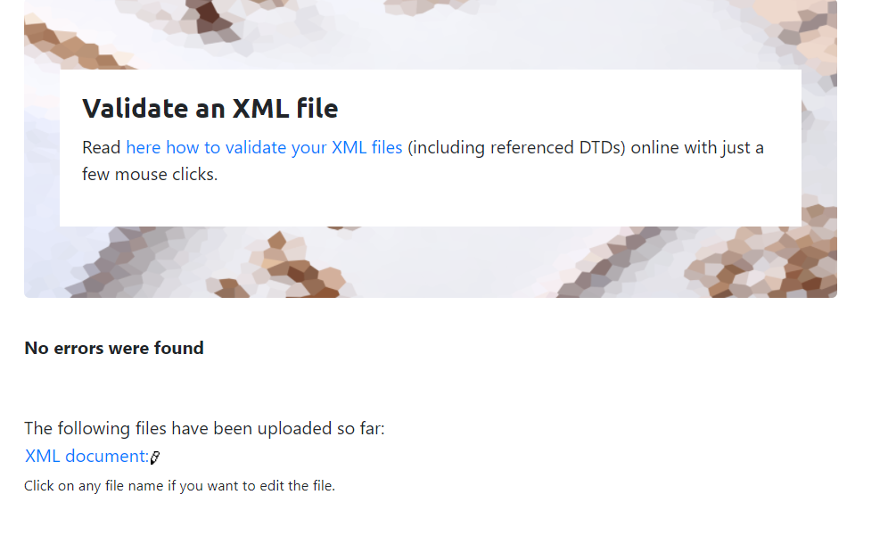

1.
This was the image I got while validating that xml file.
The error was a missing of "=" in attribute name "Date" associated with an element type "effective".There should be no space between 2 attributes or otherwise we should add "=".So in the xml,I've added no space between effective and Date.So it will become "effectiveDate".The second error is that , in the closing tag we should mention "effectiveDate" not "effective".
So the resulting code will become:

<?xml version="1.0" encoding="UTF-8" standalone="yes" ?>
<menuInfo>
  <title>Chester's Breakfast Menu</title>
  

    <![CDATA[
    If you've been craving an authentic homestyle country breakfast,
    look no further than Chester's!  We've got your breakfast favorites served
    up just the way you like them!!
    ]]>
  

  <effectiveDate>03/12/2016</effectiveDate> --this is the corrected code--
   and so on..!

corrected error image:-

2.In the xml file, CDATA blocks are used to refer summary for the title "Chester's Breakfast Menu" and descriptions to the referred item names.CDATA blocks are the block of text that xml treats as character data only.
3.Added comment line to the end of "assignment.xml" file which contains my name and student id.(edited in assignment.xml)
4.Prolog is the code of line that occurs prior to the document body.
In the given xml file,
Prolog is:- <?xml version="1.0" encoding="UTF-8" standalone="yes" ?>
Document's body is the document's content in a hierarchical  tree structure.
Document's body in this xml file is:- 
<menuInfo>
  <title>Chester's Breakfast Menu</title>
  

    <![CDATA[
    If you've been craving an authentic homestyle country breakfast,
    look no further than Chester's!  We've got your breakfast favorites served
    up just the way you like them!!
    ]]>
  

  <effective Date="date">03/12/2016</effective>
  <menu>
    <category>Traditional Favorites</category>
    <menuItem>
      <itemName>
        <originalName> Rise n' Shine</originalName>
        <oldName> Shine </oldName>
      </itemName>
      <description>
        <![CDATA[
        Two Eggs* cooked to order with Grits, Gravy and Homemade Buttermilk
        Biscuits along with real Butter and the best fresh jam
        available. Served with your choice of Fresh Fruit or Hashbrown Casserole
        and Smoked Sausage Patties, Turkey Sausage Patties or Thick-Sliced Bacon.
        ]]>
      </description>
      <price>7.95</price>
    </menuItem>
    <menuItem>
      <itemName>
        <originalName> Fresh Mornin' Sampler </originalName>
        <oldName> Mornin' Sampler </oldName>
      </itemName>
      <description>
        <![CDATA[
        Low-Fat Vanilla Yogurt and Seasonal Fruit topped with our Honey Granola
        mix of Almonds and Dried Fruit. Served with a Wild Maine Blueberry Muffin
        or an Apple Bran Muffin.
        ]]>
      </description>
      <price>6.95</price>
      <indicator>&#9829;</indicator>  <!-- heart healthy -->
      <indicator>&#9830;</indicator>  <!-- low-sodium -->
      <indicator>&#9824;</indicator>  <!-- vegan -->  
    </menuItem>
  </menu>
  <menu>
    <category>Lite and Quick</category>
    <menuItem>
      <itemName>
        <originalName> Oatmeal Breakfast </originalName>
      </itemName>
      <description>
        <![CDATA[
        Our Oatmeal is served warm with your choice of Fried Apples, Pecans, Raisins,
        Fresh Sliced Bananas or 100% Pure Natural Syrup. Also, served with your
        choice of Apple Bran Muffin or Wild Maine Blueberry Muffin. Available
        all day.
        ]]>
      </description>
      <price>6.95</price>
      <indicator>&#9829;</indicator>  <!-- heart healthy -->
      <indicator>&#9830;</indicator>  <!-- low-sodium -->
      <indicator>&#9824;</indicator>  <!-- vegan -->  
    </menuItem>
    <menuItem>
      <itemName>
        <originalName> Chester's Meat Platter </originalName>
        <oldName> Chester Platter </oldName>
      </itemName>
      <description>
        <![CDATA[
        Country Ham, Pork Chops or Steak* grilled to order, Three Eggs* cooked
        to order served with Cottage Cheese, Smoked Sausage Patties, Turkey
        Sausage Patties or Thick-Sliced Bacon.
        ]]>
      </description>
      <price>12.95</price>
      <indicator>&#9832;</indicator>  <!-- Low-carb -->
    </menuItem>
  </menu>
</menuInfo>

epilog is optional and contains final comments or processing instructions.
epilog of this xml file is :-
<!-- Shika Theresa Joseph N01494563 --> this is the final comment.
5.Added inline DTD for this document.(updated assignment.xml)
6.Verified that the file is well-formed and valid.(valid_xml.png)

7.Created style.css file and linked it to the file. Added the following styles to the .css:
*Change font-size of originalName
*Display each category on the new line
*Add any other css-rule

