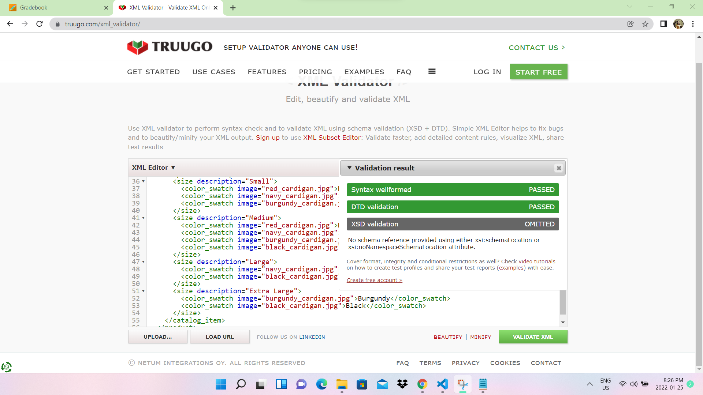
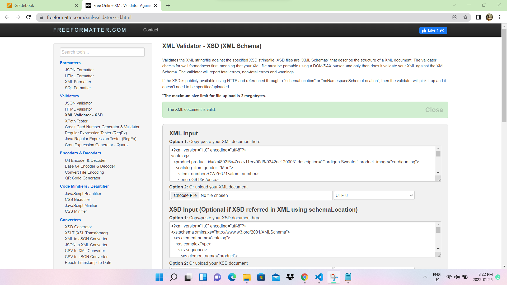

1.

This is the dtd validation screenshot I got for Assignment.xml

->The dtd can be created using 
<!DOCTYPE ..>  construct.
->We can create element declarations using <!ELEMENT ..>  construct and attribute declarations using <!ATTLIST ..>  construct. 

2.
This is the xsd validation screenshot I got for Assignment.xml

->xsd utilizes a seperate syntax for declarations.
->When we apply the xsd to an xml file, we can simply and easily validate the the document.
->xsd can have simple type or complex type.
