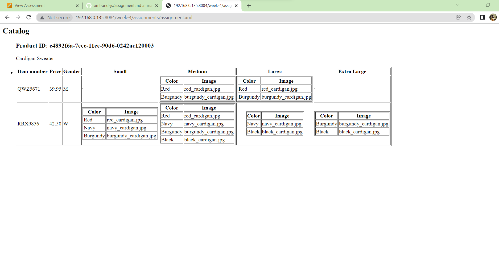

This is the final table I got.
Using XSL, we can retrieve the data that contained in an xml file .
In this assignment, I used 
<xsl:value-of> -to put the value of the selected node.
<xsl:for-each> -for repeating each node.
<xsl:choose> - refers multiple conditional tests.
etc..
It all contributes to a XSLT stylesheet.
